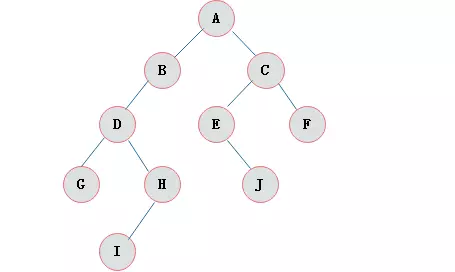
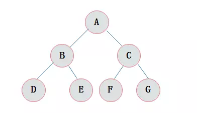
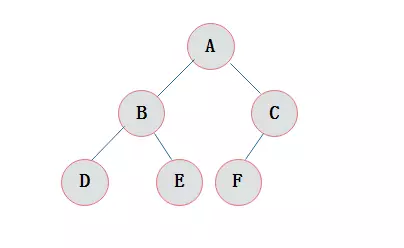

[TOC]

### 顺序表

#### 定义

使用一组连续的存储单元，依次存储线性表中的数据元素

假定线性表的元素类型为ElemType（等价于int），则可表示为：
```c
#define MaxSize 50
typedef struct _SqList
{
    ElemType data[MaxSize];
    int length;
}SqList;
```
上面这种表示属于**静态分配**内存，即在定义时就已经在内存分配了MaxSize个元素空间。当然，我们也可以使用**动态分配**内存的方法，如下：
```c
#define InitSize 50
typedef struct  _SqList
{
    ElemType *data;
    int length, MaxSize;        //线性表长度与最大长度
}SqList;
```
c的初始动态分配语句为：`L.data = (ElemType*)malloc(sizeof(ElemType) * InitSize);`
动态分配内存有一个好处就是，可以在存储空间占满时，再开辟一段内存。

#### 基本操作

- 顺序表最重要的特点就是可以**随机访问**，可以O(1)时间内找到指定元素

- 插入（直接看代码，删除类似）
```c
//将元素e插入到链表的第i个位置上
bool ListInsert(SqList &L, int i, ElemType e){
    if(i < 1 || i > L.length)       return false;
    if(L.length >= MaxSize)         return false;
    for(int j=L.length;j>=i;j--)
        L.data[j] = L.data[j-1];        //第i以及以后的元素都向后移动
    L.data[i-1] = e;
    L.length++;
    return true;
}
```
显然，平均时间复杂度为n/2,即O(n).

### 单链表

#### 定义
```c
typedef struct _LNode
{
    ElemType data;
    struct _LNode * next;
}*LNode, *LinkedList;
```
通常引入**头结点**来操作单链表，引入头结点有以下好处
考虑不带头结点的链表，则它在链表第一个位置上的操作与其他位置操作就不一样，需要特殊处理，头结点就可以避免这一点，可以通过下面的头插法看到。

#### 操作

* 初始化
```c
LinkedList InitList(LinkedList L){
    L = (LinkedList)malloc(sizeof(struct _LNode));  //创建头结点
    L->next = NULL;
    return L;
}
```

* 头插法
```c
LinkedList InsertHead(LinkedList L, ElemType e){
    LNode x = (LNode)malloc(sizeof(struct _LNode));
    x->data = e;
    x->next = L->next;
    L->next = x;
    return L;
}
```

* 按序号查找结点
```c
//约定第1位置是第一个元素。
LNode GetElem(LinkedList L, int i){
    if(i < 1)       return NULL;
    LNode p = L->next;
    int j = 1;
    while(p && j < i){
        p = p->next;
        j++;
    }
    return p;
}
```

* 插入元素和删除（以删除为例）
```c
LNode p = GetElem(L, i-1);        //获取删除位置的前驱结点
LNode q = p->next;                //令q指向被删除结点
p->next = q->next;                //删除
free(q);                 //释放空间，特别注意这个，不要忘了。
```

### 栈和队列的应用

* 栈在括号匹配的应用

假设表达式中允许出现两种括号：圆括号和方括号。考虑如下括号序列：

[([[]])]

如何判断括号是否为正确的格式呢。

    1. 初始设置一个空栈，顺序读入括号。
    2. 如果遇道左括号，则压栈
    3. 如果遇道右括号，则将当前栈中的栈顶元素出栈，查看这两个括号是否匹配，如果不匹配，则返回False，如果匹配，则继续。
    4. 当结束时，如果栈为空，则返回True；栈不为空，返回False。

* 栈在表达式求值中的作用

假设有如下中缀表达式 `A+B*(C-D)-E/F` 如果将其转换为后缀表达式 `ABCD-*+EF/-`,则表达式求值可以这样处理：

    1. 顺序扫描表达式，如果它是操作数，则将其压入栈中；
    2. 如果它是操作符，则连续从栈中退出两个操作数X，Y，运算后将结果再次压入栈中。

* 队列在层次遍历中的作用

假设有如下二叉树：



则层次遍历二叉树的过程如下：

| 序 |    说明   | 队内 |  遍历元素 |
|----|-----------|------|-----------|
|  1 | A入       | A    |           |
|  2 | A出，BC入 | BC   | A         |
|  3 | B出，D入  | CD   | AB        |
|  4 | C出，EF入 | DEF  | ABC       |
|  5 | D出，GH入 | EFGH | ABCD      |
|  6 | E出，J入  | FGHJ | ABCDE     |
|  7 | F出       | GHJ  | ABCDEF    |
|  8 | G出       | HJ   | ABCDEFG   |
|  9 | H出，I入  | JI   | ABCDEFGH  |
| 10 | J出       | I    | ABCDEFGHJ |
| 11 | I出       |      | ABCDEFGHJI|

### 二叉树

#### 分类

满二叉树：



完全二叉树：



####  二叉树的存储结构

显然，对于满二叉树和完全二叉树适合顺序存储，因为数组正好能够被填满。

二叉树的链式存储描述如下：
```c
typedef struct _BiNode
{
    ElemType data;
    struct _BiNode *lchild, *rchlid;
}*BiNode, *BiTree;
```

#### 二叉树的遍历
```c
/*二叉树的前序遍历递归算法*/
void PreOrderTraverse(BiTree T)
{
    if(T==NULL)     return;
    printf("%c", T->data);  /*显示结点数据，可以更改为其他对结点操作*/
    PreOrderTraverse(T->lchild);    /*再先序遍历左子树*/
    PreOrderTraverse(T->rchild);    /*最后先序遍历右子树*/
}


/*二叉树的中序遍历递归算法*/
void InOrderTraverse(BiTree T)
{
    if(T==NULL)      return;
    InOrderTraverse(T->lchild); /*中序遍历左子树*/
    printf("%c", T->data);  /*显示结点数据，可以更改为其他对结点操作*/
    InOrderTraverse(T->rchild); /*最后中序遍历右子树*/
}


/*二叉树的后序遍历递归算法*/
void PostOrderTraverse(BiTree T)
{
    if(T==NULL)     return;
    PostOrderTraverse(T->lchild);   /*先后序遍历左子树*/
    PostOrderTraverse(T->rchild);   /*再后续遍历右子树*/
    printf("%c", T->data);  /*显示结点数据，可以更改为其他对结点操作*/
}
```

#### 二叉排序树(BST)

- 定义：二叉排序树或者是一颗空树，或者是一颗具有如下性质的二叉树，

    1）若左子树非空，则左子树上所有结点关键字值均小于根结点关键字值
    2）若右子树非空，则右子树上所有结点关键字值均大于根节点关键字值
    3）左子树和右子树本身也分别是一颗二叉排序树。

- 查找
```c
BiNode BST_Search(BiTree T, ElemType e){
    while(T != NULL && e != T->data){
        if(key < T->data)   T = T->lchild;
        else        T = T->rchild;
    }
    return T;
}
```

- 插入（通过插入来构建一个二叉排序树）
```c
bool BST_Insert(BiTree T, ElemType e){
    if(T == NULL){
        T = (BiTree)malloc(sizeof(struct _BiNode));
        T->data = e;
        T->lchild = T->rchild = NULL;
        return true;        //表示成功
    }
    else if(e == T->data)       return false;
    else if(e < T->data)        return BST_Insert(T->lchild, e);
    else            return BST_Insert(T->rchild, e);
}

//用关键字数组str来建立二叉树
void CreateBST(BiTree T, ElemType str[], int n){
    T = NULL;
    int i = 0;
    while(i < n){
        BST_Insert(T, str[i]);
        i++;
    }
}
```

### 图

* 图的遍历
    - 广度优先搜索（BFS）
        广度优先搜索同树的层次遍历结果相同。因此只要从图的任意一个结点出发，实现层次遍历即可。
    - 深度优先搜索（DFS）
        深度优先搜索同树的前序遍历相同。

    无论是BFS还是DFS，都需要一个visit[]数组，用于标识某个结点已经被访问过。

```c++
//假如此时的图的结点数据使用邻接链表的形式存储的。
typedef struct _Edge
{
    char nextNode;   //下一个结点编号
    int cost;       //边的权重
}Edge;

vector<Edge> edge[n]; //此时edge[i]是一个链表，链表中的每个结点表示从结点i与它们相邻
bool visited[Max_Vertex_Num] = { false };   //使用visited数组，避免重复遍历
queue<char> Q;

//除了visited数组以外，整个就是一个层次遍历
void BFS(int v){    //从某个结点开始
    printf("%c", v);
    visited[v] = true;
    Q.push(v);      //将该节点入队列
    while(!Q.empty()){
        int node = Q.top();
        Q.pop();
        //遍历每一个链表，将其所有邻接结点（先前没有访问过的）入队
        for(int i=0;i<edge[node].size();i++){
            int nextNode = edge[node][i].nextNode;     //读出邻接结点编号
            if(visited[nextNode] == false){
                printf("%c", nextNode);
                visited[nextNode] = true;
                Q.push(nextNode);
            }
        }
    }
}
```

* 最小生成树（MST）

* 最短路径

* 拓扑排序

#### 排序

* 插入排序（给定关键字序列为`{ 4, 5, 1, 2, 6, 3 }`)

    * 直接插入排序

    思路：循环不变式A[0..j-1]已经有序，将A[j]插入到这个已排序的数组中。

    1. 遍历A[0..j-1]找到第一个比A[j]大的数所在的位置k
    2. 将A[k..j-1]所有的数字都向后移动一个位置
    3. 将A[j]插入到k所在的位置

    时间复杂度为O(n^2),稳定排序

    | 趟数   | A[0..j-1]情况 |
    | :----: | :----------: |
    | 1      | 4            |
    | 2      | 4 5          |
    | 3      | 1 4 5        |
    | 4      | 1 2 4 5      |
    | 5      | 1 2 4 5 6    |
    | 6      | 1 2 3 4 5 6  |

    * 折半插入排序

    思路：由于循环不变式A[0..j-1]已经有序，所以我们想到使用折半查找的方式找到插入位置

    折半查找只是减少了元素之间比较的次数（即上面第1步），但移动次数不变，仍为O(n^2).

    * 希尔排序(假设将上面的分为两组)

    思路：先将待排序序列分为若干个 L[i, i+d, i+2d, ... i+nd]的子表，对每个字表使用直接插入排序，当整个序列已成“基本有序“时，再对全体元素直接插入排序。

    当序列长度n在一个特定范围时，时间复杂度为O(n^1.3).不稳定排序

    | 趟数 |   序列情况  |
    |------|-------------|
    |    1 | 4 5 1 2 6 3 |
    |    2 | 4 5 1 2 6 3 |
    |    3 | 1 4 5 2 3 6 |
    |    4 | 1 2 3 4 5 6 |

* 交换排序（给定关键字序列为`{ 4, 5, 1, 2, 6, 3 }`)

    * 冒泡排序

    思路：假设待排序序列长度为n，从后往前（或从前往后）两两比较元素的值，若`A[i-1] > A[i]`,则交换它们。当一次冒泡后，将最小的元素交换到序列的第一个位置上，依次类推。

    时间复杂度O(n^2),稳定排序

    | 趟数 |   序列情况  |
    |------|-------------|
    |    1 | 1 4 5 2 3 6 |
    |    2 | 1 2 4 5 3 6 |
    |    3 | 1 2 3 4 5 6 |
    |    4 | 1 2 3 4 5 6 |
    |    5 | 1 2 3 4 5 6 |
    |    6 | 1 2 3 4 5 6 |

    * 快速排序（这里使用第一个元素为基准）

    思路：在待排序序列中选取一个元素为基准privot，通过一次排序将序列分为两部分A[0..i-1]和A[i+1..n-1],使得L[0..i-1]的元素都小于privot，L[i+1..n-1]的元素都大于privot，且privot放在其最终位置A[i]上。然后递归地对两个子表重复上述过程。（一般选取第一个元素或者最后一个元素为基准）

    细节：在子序列A[p..q]中，设置一个哨兵privot = A[p],将每个元素同基准privot进行比较，如果小于基准元素，则将其和A[p]交换，下一次就和A[p+1]交换，依次类推。

    时间复杂度为O(nlogn),不稳定排序

    | 第一趟排序情况 |
    |----------------|
    | 1 5 4 2 6 3    |
    | 1 2 4 5 6 3    |
    | 1 2 3 5 6 4    |
    | 1 2 3 4 6 5    |

    基准元素4在其最终位置上。

* 选择排序(给定关键字序列为`{ 4, 5, 1, 2, 6, 3 }`)

    * 简单选择排序 

    思路：假设排序序列为L[1..n],第i趟排序将L[i..n]中选择第i小的元素和L[i]交换。每一趟都能确定一个元素的最终位置。

    时间复杂度为O(n^2)

    | 趟数 |   序列情况  |
    |------|-------------|
    |    1 | 1 5 4 2 6 3 |
    |    2 | 1 2 4 5 6 3 |
    |    3 | 1 2 3 5 6 4 |
    |    4 | 1 2 3 4 6 5 |
    |    5 | 1 2 3 4 5 6 |

    * 堆排序

    思路：使用了堆这种数据结构，它是一个完全二叉树，且大顶堆中最大的元素在根节点，小顶堆中最小的元素在堆顶。最主要的过程就是一个调整堆的过程。

    细节：假设序列长度为n，从n/2到1开始，依次调整堆。每次调整过程为：找到孩子结点中关键字较大的，如果这个值大于它，则交换它们。否则不变。这样调整n/2次，序列就变为大顶堆了。

    | 趟数 |   序列情况  |       说明      |
    |------|-------------|-----------------|
    |    0 | 4 5 1 2 6 3 | 初始序列        |
    |    1 | 4 5 3 2 6 1 | 将1这个元素调整 |
    |    2 | 6 4 3 2 5 1 | 将5这个元素调整 |

    想要输出从大到小的排序数组的话，只需要每次将大顶堆的根节点关键字输出，并从大顶堆中删除，然后对剩下的元素继续维护大顶堆。

* 归并排序和基数排序(给定关键字序列为`{ 4, 5, 1, 2, 6, 3 }`)
    
    * 归并排序

    思路：假定待排序含有n个记录，则可以看成n个有序的子表，每个子表长度为1，然后两两归并，得到 n/2 个长度为2或1的有序表；再两两归并，直到合并成一个长度为n的有序表为止，这种排序方法称为2路-归并排序。

    | 趟数 |   序列情况  |
    |------|-------------|
    |    1 | 4 5 1 2 3 6 |
    |    2 | 1 2 4 5 3 6 |
    |    3 | 1 2 3 4 5 6 |

    * 基数排序

    思路：假设有如下序列： 329， 457， 657， 839， 436， 720， 355。 则我们首先按个位数字大小排序，再按十位数字排序.....直到全部排序。

#### 散列表

散列表（Hash table，也叫哈希表），是根据关键码值(Key value)而直接进行访问的数据结构。也就是说，它通过把关键码值映射到表中一个位置来访问记录，**以加快查找的速度**。这个映射函数叫做散列函数，存放记录的数组叫做散列表。

一个把查找序列中的关键字映射到关键字对应的地址上的函数，称为哈希函数，记为`Hash(key) = Addr (这里的地址可以是数组下标，索引，或内存地址等)`

* 常见散列函数：

    1. 直接寻址法：直接取关键字的某个线性函数为散列地址 `H(key) = a * key + b`,其中a和b是常数。

    2. 数字分析法
    3. 平方取中法
    4. 折叠法
    5. 随机数法

    6. 除留余数法：假定表长为m，取一个不大于m但最接近于m的m的质数p，利用以下公式把关键字转换为散列地址， `Hash(key) = key % p`

应当注意到，任何散列函数都不可能避免冲突，因此一方面需要设计好的散列函数来减少冲突的几率，另一方面，还要设计处理冲突的方法。

* 处理冲突的方法（即为产生冲突的关键字寻找下一个“空”的hash地址）

    1. 开放定址法

        数学递推公式为： `H = (Hash(Key) + d) %  m`,其中m表示散列表表长，d为增量序列
    
        线性探测法：当d取0，1，2，3...m-1时，称为线性探测法。特点为：冲突发生后，顺序查找表中的下一个单元（当探测到表尾m-1时，下一个探测地址为0），直到找到一个空闲单元（当表未填满时一定能够找到）。

        线性探测法可能使散列到表中第i个位置的关键字放入第i+1个位置，这样本应存入第i+1个位置的关键字就争夺第i+2个位置.....，从而造成大量元素在相邻的散列地址上“聚集”，大大降低了查找效率。

    2. 再散列法

        当第一个散列函数发生冲突后，利用第二个散列函数计算散列地址，公式如下

        H = (Hash1(key) + i * Hash2(key)) % m

        其中，i表示冲突次数，初始为0。

    3. 拉链法

        使用同义词（发生冲突的关键字）链来处理冲突，即当出现一个关键字的散列地址同先前已有的关键字散列地址相同时，将这个关键字存储在前一个相同关键字的后面，用链表将这些关键字链接起来。适用于经常进行删除或插入的情况（链表的优点）。

        可以理解为：哈希表的每一个地址都是一个链表，通过一个散列函数散列到这个地址的所有关键字都在这个链表中。

* 查找过程举例
    
    例如，关键字序列{19, 14, 23, 1, 68, 20, 84, 27, 55, 11, 10, 79}按照散列函数H(key) = key % 13和线性探测法构造散列表如下（表长为16）

| 0 | 1  | 2 | 3  | 4  | 5  | 6  | 7  | 8  | 9  | 10 | 11 | 12 | 13 | 14 |15|
|---|----|---|----|----|----|----|----|----|----|----|----|----|----|----|--|
|   | 14 | 1 | 68 | 27 | 55 | 19 | 20 | 84 | 79 | 23 | 11 | 10 |    |    |  |

    由上面的构造结果可以看到，14和1的散列地址都是1，但是14先在1，所以1只能向后移动一个位置了。

    给定值84的查找过程如下：首先求得散列地址 H(84) = 6, 因表中地址为6不空且 L[6] 不等于84， 则找第一个冲突的地址 H1 = (6+1) % 16 = 7, 依次找下去，直到找到 L[8]不为空且等于84，则查找成功。

    给定值38的查找过程如下：首先求得散列地址 H(38) = 12, L[12]不为空且L[12] 不等于38，则使用线性探测法加一后求得13， 由于L[13]为空，则查找失败。

* 散列表的查找效率

    取决于三个因素：散列函数，处理冲突的方法和**装填因子**

    a = 表中记录数/散列表长度

    在上例中，表中记录数等于 12， 标长为 16.

#### 单源最短路径（Dijkstra算法）

该算法设置一个集合S记录已求得的最短路径的顶点，可用一个数组s[]表示，初始化为0；当`s[vi][i] = 1`时表示将结点vi放入S中，初始时将源点v0放入其中，假设arcs[][]为存储图的邻接矩阵，源点为0，总结点为0 ~ n-1。此外，还设置了两个辅助数组：

dist[]:记录了从源点到其他各顶点最短路径长度，初值为`arcs[0][i]`;

path[]:path[i]表示从源点到顶点i之间的最短路径的前驱结点，在算法结束时，可以追溯到源点0到顶点i的最短路径。

假设从顶点0出发，集合S最初只包含0，邻接矩阵arcs表示带权有向图，arcs[i][j]表示从结点i到结点j之间有向边的权值，如果没有边，则为 无穷。 过程如下:

> 初始化：集合S初始为{ 0 }, dist[] 的初始值为 dist[i] = arcs[0][i];

> 从顶点集 V - S 中选出 Vi，满足 dist[j] = min{dist[i]}, j就是当前求得的一条从0出发的最短路径的终点，令 S = S U {j};

> 修改从0出发到集合V - S上的任一顶点k可达的最短路径长度： 如果 `dist[k] + arcs[j][k] < dist[k]` 则令 `dist[k] = dist[k] + arcs[j][k], path[k] = j`

> 重复第二步和第三步，直到所有结点都在集合S中。

**注意：在第二步中，第一趟时，找到的是距离0可达且最近的结点x， 在第二趟时找到的就是距离x可达且最近的结点y**

#### 平衡二叉树（AVL树）

平衡二叉树（Balanced Binary Tree是这样一棵树，或者它是一颗空树或者它的左右子树的高度差的绝对值不超过1（-1，0，1），且左右子树也是平衡二叉树。定义这个左子树高度 - 右子树高度的值为**平衡因子**，最早发明这个树就是为了 防止二叉排序树的高度增长过快。

保持平衡的基本思想是：每当在二叉排序树中插入（或删除）一个结点时，首先要检查其插入路径上的结点是否因为此次操作而导致了不平衡。如果导致了不平衡，则先找到插入路径上里插入节点最近的平衡因子绝对值大于1的结点A，再对以A为根的子树，在保持二叉排序树的性质的基础上，调整各节点的位置关系，使其平衡。

查找，插入和删除的时间复杂度为 O(logn);

#### 查找

若在查找的同时还对表做修改运算（插入或删除），则相应的表称为动态查找表，反之称为静态查找表。顺序查找和折半查找为静态查找，B树和B+树查找为动态查找

* 顺序查找

    从线性表的一端开始，逐个检查关键字是否满足给定条件。使用于线性表的顺序存储和链式存储

* 折半查找
    
* B树和B+树

    B树，又称为多路平衡查找树，B树中所有结点的孩子结点数的最大值称为B树的阶，通常用m表示。一颗m阶B树，或者为空树，或为满足如下性质的m叉树：

    * 树中每个结点至多有m颗子树，（即至多含有m-1个关键字）
    * 若根节点不是终端结点，则至少有两颗子树
    * 除根节点以外的所有非叶节点至少有 m/2 取上整棵子树（至少含有 m/2 去上整减一关键字）
    * 所有的叶节点都在同一层，且不带任何信息
    * 所有结点平衡因子均等于0

    B树的查找分为两个步骤： 1）在B树中找结点 2）在结点内找关键字。由于B树常存储在磁盘上，则前一个查找在磁盘上进行，而后一个查找在内存中进行。即在查找到目标结点后，再将结点的信息读入内存，然后采用顺序查找或者折半查找等于K的关键字。

    B树的插入：首先使用上面的查找算法，找出插入该关键字的最底层的非叶节点；当插入关键字使得找到的结点的关键字个数大于 m-1 时，则必须对结点进行分裂。分裂插入操作有可能使B树增加一层

    B树的删除：两大类，第一类在非最底层的非叶节点上删除，第二类在最底层的非叶节点删除关键子，这类型又分为三种情况，情况一，直接删除关键字；情况二，兄弟够借；情况三，兄弟不够借。有可能导致B树减少一层。

    B+树与B树的不同：

    * B+树中所有有效数据全在叶子节点，而B树种所有结点分散在树中，B+树中关键字重复，B树不重复
    * B+树中有几个关键字就有几个子树，B树中具有n个关键字的结点具有n+1个子树
    * B+树中有两个指针，一个指向根节点，一个指向最小关键字的叶节点。叶节点按关键字有序排列，并且所有叶子节点使用指针链接成一个链表
    * B+树种所有非叶节点仅仅起到索引的作用。
    * B+树是应数据库所需而存在的

#### 典型问题

1. 循环队列的顺序表示中，为什么要空出一个位置？
    
    答： 为了便于判断队空或队满。

2. 什么是二叉查找树(又称二叉排序树），及其原理

    答:二叉查找树,它或者是一棵空树；或者是具有下列性质的二叉树： 

    （1）若左子树不空，则左子树上所有结点的值均小于它的根结点的值； （2）若右子树不空，则右子树上所有结点的值均大于它的根结点的值； （3）左、右子树也分别为二叉排序树；

    步骤：若根结点的关键字值等于查找的关键字，成功。
    否则，若小于根结点的关键字值，递归查左子树。
    若大于根结点的关键字值，递归查右子树。
    若子树为空，查找不成功。

3. 什么是哈希冲突，如何解决？

    答：散列函数将两个或两个以上的关键字映射到表中的同一位置上，称为哈希冲突。可以通过开放地址法，再散列法，拉链法处理。

4. 图的深度优先遍历序列是否唯一？为什么？

    答：不一定唯一。当从某顶点x出发搜索时，若x的邻接点有多个尚未访问到，则可以任意选择一个访问。

5. 链表查询某个元素，时间复杂度为？

    答： O(n)

6. 图的存储方式有哪几种？

    答： 邻接矩阵，使用二维数组存放结点之间的边的关系；邻接表，为每一个结点都设置一个链表，表示和这个结点存在边的结点放在当前结点链表中；十字链表，**有向图的另一种链式存储结构**；邻接多重表，**无向图的另一张链式存储结构**

7. 连通图的概念

    答： 任意两个结点之间都有路径。

8. 解释下最小生成树

    答：也是一个**连通图**的最小连通子图，1.包含图中全部结点； 2.若砍去它的一条边，则变成非连通图； 3.若增加一条边，则出现回路。最小生成树共有n个结点，n-1条边。

9. 单链表就地逆置算法解释

    答：所谓“就地”是指算法复制空间为 O(1).思路：假设在带有头结点的单链表中，设置一个指针p初始化为`L->next`，再将头结点L的next设置为NULL而变成一个空表，然后遍历原链表将 p结点采用头插法插入到L中。时间复杂度为 O(n).

