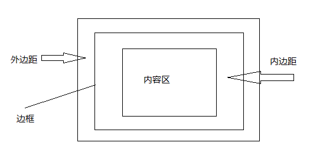

[TOC]

# 验证HTML和CSS合法性的网站

`https://validator.w3.org/` 以及 `http://jigsaw.w3.org/css-validator/validator.html.en`

# 标签总结

```
/*标签可以嵌套*/

/*绝大多数的块元素之间都是空两行，<br>只是空一行*/

<html>          //表明这是一个html文件

<head>          //html头部

<meta>          //字符集

<title>         //html标题

<body>          //网页内容主体

<style>         //样式

<h1>            //内容标题

<p>             //段落

<em>            //强调文本

<a>             //链接

           //插入图片

<q>             //短引用,就只是加了双引号

<blockquote>    //长引用

<br>            //换行

<ol>            //有序列表      ordered list

<ul>            //无序列表

<li>            //列表项       list item

<div>           //为块元素设置逻辑分区

<span>          //为内联元素设置分区

/*特殊字符*/

> &gt;      < &lt;      & &amp;     版权符号 &copyright;

html属性:<a>中的href 中的src background-image中的url都是路径,都可以使用相对路径或绝对路径或网上的地址.
```

# 示例

#### 创建带链接的图片，链接到id的地方（使用路径名+#+id），可以为任意元素添加title提示

```html
<!--如果要链接到别人的网站的特定位置，查看源代码并找到位置所在的id值是最有效的方法-->
<!--target表示链接到页面的方法，如果为空，则表示在当前页面打开，如果为_blank，表示在新的窗口打开。-->
<a href="www.baidu.com#id" title="This is a baidu" target="_blank">
    
</a>
```

#### 显示图片

```html
<!--我们可以设置图片的宽度和高度，但是一般我们不应该这么做，如果我们需要多大的空间来放置图片，图片就应该设置为多大
（可以使用图像编辑软件设置分辨率），因为设置宽高浏览器仍然会加载整个原始图片。-->
<!--甚至有时候我们需要缩略图（thumbnails），要将图片大小设置的更小（画图软件就可以）-->
<!--一般情况，我们想要图片（尤其是logo）背景透明，这时一般我们需要设置两个属性，transparency和蒙版Matte（提供柔化文本边缘的
颜色），一般设置为和网页背景颜色相同-->
<!--alt属性提供当图片加载不出来的显示文本-->

```

#### 基本CSS

```css
/*基本样式*/
/*设置body区域的字体，h1，h2的颜色，边框，em颜色*/
body {
    font-family: sans-serif;
}
/*对两种元素设置相同样式*/
h1, h2 {
    color: gray;
    border: 1px solid black;
}
/*由于某些样式是继承的，所以想要覆盖样式，就必须写在下面*/
em {
    font-family: serif;
}
```

#### 添加一个class，id

```html
<!--把元素添加到类中，可以将多个元素添加到一个类中，一个元素也可以加入多个类，之间用空格隔开。但只能有唯一的id属性-->
<p class="text name" id="name">yangweijie</p>
<blockquote class="text">
    To be or not to be
</blockquote>
```

```css
/*使用.选择类，使用#选择id*/

/*选择所有归属于类text的元素，设置样式*/
.text {
    color: red;
}
/*选择id为name的p元素，本来id只有一个，理论上只需要使用#name即可，但是CSS文件有可能用于不同的html文件，这时指定p就有用了。*/
p#name {
    font-size: 18px;
}
```

#### 增加字体，大小，粗细，装饰和颜色样式

* 字体系列，共有5个字体系列：sans-serif, serif, monospace, cursive和fantasy

|  字体系列  |               常见种类              |
|------------|-------------------------------------|
| sans-serif | Verdana, Arial Black, Arial, Geneva |
| serif      | Times，Times New Roman，Georgia     |
| monospace  | Courier，Courier New，Mono          |
| cursive    | Comic Sans，Apple Chancery          |
| Fantasy    | Impact，LAST NINJA                  |

```css
/*通常我们使用font-family指定多个字体，他们都属于一个字体系列,最后一个总是放通用字体，如果字体名出现空格，则需要加上引号*/
body {
    font-family: Verdana, "Arial Black", Arial, Geneva, sans-serif;
}
/*使用web字体*/
@font-face {
    /*为从url中获取的字体取一个名字，这里是Emblema One*/
    font-family: "Emblema One";
    /*可以获取多个字体格式，可以使用网络路径，也可以下载到本地。每个url之间使用逗号隔开，最后使用分号*/
    src: url("http://wickedlysmart.com/hfhtmlcss/chapter8/journal/EmblemaOne-Regular.woff"),
         url("/var/www/html/fonts/EmblemaOne-Regular.ttf");
}
/*由于移动设备和小型设备不支持web字体，所以一定要添加候选字体*/
h1 {
    font-family: "Emlema One", sans-serif;
}
```

* 字体大小，四种指定大小的方法，使用像素，相对大小（%， em），关键字

```css
/*一般在body中选择一个大小small或medium，设为页面字体的默认大小。*/
/*在其他元素中使用em或%来指定相对于body的大小。*/
body {
    font-size: 14px;                /*使用像素*/
}
h1 {
    font-size: 150%;                /*是父字体的1.5倍*/
}
h2 {
    font-size: 1.2em;               /*与%相同*/
}
p {
    /*有xx-small，x-small，small，medium，large，x-large，xx-large中关键字，small大约为12像素*/
    font-size: small;
}
```

* 字体粗细和斜体

```css
body{
    font-weight: bold;              /*字体加粗，还有normal*/
    font-style: italic;             /*字体斜体，还有not italic*/
}
```

* 字体颜色或背景颜色，三种指定颜色方法，按名字，按红绿蓝值，按十六机制

    想要找到自己喜欢的颜色，可以到网上寻找。

```css
body {
    background-color: red;
}
h1 {
    color: rgb(80%, 40%, 0%);       /*或rgb(204, 102, 0)*/
}
p {
    /*十六进制cc正好为204，66正好为102，0为0.*/
    color: #cc6600;
}
```

* 文本装饰

```css
em {
    /*下划线,上划线和删除线*/
    text-decoration: underline overline line-through;
    /*如果有文本继承了你不想要的装饰，也可以不要任何修饰text-decoration: none*/
}
```

#### CSS盒模型

从css的角度看，几乎所有的元素都可以看作一个盒子，它有一个内容区，内边距，边框，外边距，如下图：



整个外边距，边框和内边距大小两倍加上内容去大小才是整个元素所占的大小。

```css
.guarantee {
    /*内边距，边框和外边距*/
    padding: 25px;
    border: 2px solid black;
    margin: 30px;
    /*也可单独指定一边边距*/
    margin-right: 60px;
}
```

#### 设置背景图片

```css
.guarantee {
    /*注意，在url中，不需要使用引号*/
    background-image: url(images/background.gif);
    /*由于默认的图片会在上下平铺,如果只想要出现一个图片或者只在x轴上重复*/
    /*repeat（默认），no-repeat（x，y轴都不重复），repeat-x（只在x轴重复，y轴同理），inherit（同父元素设置一致）*/
    background-repeat: no-repeat;
    /*设置图片位置，top，left，right，bottom，center*/
    background-position: top left;
}
```

#### 边框

```css
/*边框样式：solid实线，dotted虚线，double双线，dashed破折线，groove槽线，inset凹线，outset凸线，ridge脊线*/
/*如果需要用到边框样式，可以都尝试以下*/
p {
    border-style: groove;
    /*设置边框宽度，可以使用像素，也可以使用thin，medium或thick*/
    border-width: 5px;
    /*边框颜色*/
    border-color: red;
    /*边框圆角*/
    border-radius: 15px;
}
```

#### 链接多个样式表

* 第一种情况：如果你使用的是别人的样式表，我们所需要做的不是修改别人的样式表，而是自己写一个，让html链接两个样式表，让自己的样式表覆盖他人的。

* 第二种情况：我们想要在不同的设备上显示不同的样式表，比如不是在pc，而是mobile

```css
/*为手机指定不同的样式，media元素用于指定设备类型*/
<link href="lounge-mobile.css" rel="stylesheet" media="screen and (max-device-width: 480px)">
<link href="loung-print.css" rel="stylesheet" media="print">
```

除了可以使用多个link指定media属性以外，还可以使用css内置的@media规则

```css
/*max-device-width是实际设备大小，要想使用浏览器窗口大小，需要使用max-width*/
@media screen and (min-device-width: 481px) {
    p {
        color: red;
    }
}
@media screen and (max-device-width: 480px) {
    p {
        color: green;
    }
}
```

#### 分区div和span

```html
<div id="elixirs">yangweijie</div>
```

```css
#elixirs {
    /*设置分区宽度（高度一般不指定），width属性只指定内容区的宽度，可以使用像素，也可以使用%，则表示父元素大小的百分比*/
    width: 200px;
    /*分区文本对齐格式，居中。text-align会对分区内的所有内容对齐，不限于文本，包括图片等，text-align只能在块元素上使用，直接在<
    img>上使用无效*/
    text-align: center;
    /*设置行高，line-height有点特殊，我们可以指定百分比，也可以直接指定一个数字，表示与当前文本字体大小的倍数*/
    line-height: 1;                 /*line-height: 1em;*/
}
```

#### 选择子孙和直接孩子

```css
/*选择子孙，会一直递归下去*/
div h2 {
    color: black;
}
#elixirs h2 {
    color: red;
}
/*选择直接孩子*/
#elixirs>h2 {
    color: green;
}
```

#### 链接状态以及伪类

`<a>`元素有多种状态：link，visited，hover，focus，active。（设置css样式时顺序一般就是这个顺序）

```css
#elixirs a:link {
    color: #007e7e;
}
#elixirs a:hover {
    color: #0d5353;
}
```

#### 浮动和流模型

如何浮动元素(这个元素就像从普通的页面流中删除一样，浮动在页面上面，其他文本会环绕这个元素)
    
    1. 指定一个标识id
    2. 指定一个宽度，想要浮动，必须指定宽度
    3. 加上float属性

```css
/*注意，无论是浮动到左边还是右边，html文本都必须放在上面的元素挨下面*/
#amazing {
    width: 200px;
    float: right;
}
#footer {
    clear: both;                /*使用clear来解决重叠问题left，right或both*/
}
```

#### 固定布局和凝胶布局

```css
#allcontent {
    width: 800px;               /*将主元素的宽度固定，就是固定布局*/
    /*当添加以下代码时，就是凝胶布局*/
    /*使用auto，浏览器会自动扩展内容区，这样元素就会居中显示*/
    margin-right: auto;
    margin-left: auto;
}
```

#### 绝对定位和固定定位

当一个元素绝对定位时，浏览器首先就是将它从流中完全删除，然后将这个元素放置在top，right等属性指定的位置上

```css
#siderbar {
    position: absolute;
    top: 100px;
    right: 200px;
    width: 280px;
}
```

```css
/*固定定位，它可以展现一个特效，当滑动滚动条时，元素一直在页面的同一位置（相当于跟着动）*/
#coupon {
    position: fixed;
    top: 300px;
    left: -100px;               /*固定定位可以使用负的属性值，使得元素看起来像是挂在页面上一样*/
}
```

#### CSS表格布局

CSS表格布局是一种逻辑上分为的表格，与html中的表格table不同

首先在html中设置表格的id

```html
<div id="tableContainer">
    <div class="tableRow">
        <div id="main">......</div>
        <div id="siderbar">.......</div>
    </div>
    ...
</div>
```

```css
#tableContainer {
    display: table;                 /*使用display属性将这个设置为表格布局*/
    border-spacing: 10px;           /*为表格增加10px的边框间距*/
}
.tableRow {
    diplay: table-row;              /*设为表格的一行*/
}
#main {
    display: table-cell;            /*设为表格的一个单元格*/
    vertical-align: top;            /*设置单元格所有内容上边对齐*/
}
```

#### HTML表格

* 最简单的表格

```html
<!--甚至可以在表格的单元格内嵌套表格-->
<table>
    <!--表格标题，可以使用css样式将其放在表格下方-->
    <caption>Table</caption>
    <!--表格的一行-->
    <tr>
        <!--表格的表头-->
        <th>name</th>
        <th>age</th>
        <th>birth</th>
    </tr>
    <tr>
        <!--表格的一个单元格-->
        <td>yang</td>
        <td>22</td>
        <td>1998-02-02</td>
    </tr> 
    <tr>
        <!--合并单元格，可以横向也可以纵向，colspan-->
        <td rowspan="2">yangweijie</td>
        <td>21</td>
        <td>1997-11-29</td>
    </tr>
    <tr>
        <td rowspan="2">yangweijie</td>
        <td>1997-11-29</td>
    </tr>
</table>
```

```css
table {
    caption-side: bottom;       /*标题位置*/
    /*单元格之间的间距，设置为0，这样两个边框就会合并了，不过现在的浏览器不需要这个了（起码在我的chrome上是这样的）*/
    border-spacing: 0px;
    /*表格有一个折叠边框的功能*/
    border-collapse: collapse;
    /*为表格的奇数行和偶数行设置不同的颜色，以便区分，使用伪类*/
    tr:nth-child(even) {
        background-color: red;
    }
    tr:nth-child(odd) {
        background-color: green;
    }
}
```

#### HTML表单

表单提交get和post的不同，get会之间将表单信息追加到原来的域名后面，相当于直接请求页面。post是先将表单信息发送给服务器，服务器处理表单信息，做出响应，然后返回一个html页面。由于get会将所有信息追加到尾部，所以如果有密码等信息，我们都应该使用post方法提交。

```html
<!--form就代表一个表单，它是一个块元素，几乎任何元素都可以放在表单中-->
<!--使用action属性设置表单提交后处理表单的文件名，method属性为表单提交的方式，由post和get两种-->
<form action="http://wickedlysmart.com/hfhtmlcss/contest.php" method="POST">
    <!--input表示输入框，type表示类型，name表示名字（用于服务器处理）,maxlength设置文本最大长度-->
    <input type="text" name="name" maxlength="200">
    <input type="submit">
    <!--单选框,checked属性表示默认选中，复选框也可以使用这个属性-->
    <input type="radio" name="hotornot" value="hot" checked>
    <input type="radio" name="hotornot" value="not">
    <!--复选框-->
    <input type="checkbox" name="fruit" value="apple">
    <input type="checkbox" name="fruit" value="orange">
    <!--多行文本域-->
    <textarea name="comments" rows="10" cols="48"></textarea>
    <!--select菜单选择,可以设置多选，使用ctrl或shift-->
    <select multiple>
        <option value="Fruit Apple">Apple</option>
        <option value="Orange">Orange</option>
    </select>
    <!--数字-->
    <input type="number" min="0" max="20">
    <!--滑动条-->
    <input type="range" min="0" max="20" step="5">
    <!--颜色选择器，除此之外还有，date，tel，email，url等-->
    <input type="color">
    <br>
    <!--将标签和表单链接起来，一个使用id，一个使用for-->
    <label for="name">name: </label><input type="text" name="name" id="name">

    <!--使用fieldset和legend来将公共区域组织在一起-->
    <fieldset>
        <legend>Condiments</legend>
        <!--这个地方放置公共内容-->
    </fieldset>
    <!--使用password表示密码，file表示选择文件，placeholder属性用于提示信息，required表示域不为空-->
    <input type="password" name="serect">
    <input type="file" name="doc">
    <input type="text" name="name" placeholder="Please input a name" required>
</form>
```

#### 特定与列表的两个属性，list-style-type和list-style-image

```css
li {
    list-style-type: disc;          /*有几种，disc，circle，square，none等*/
    list-style-image: url(images/backpack.gif);
}
```

#### 更多CSS选择器

* 伪元素

```css
/*first-letter表示第一个字母，first-line表示第一行等等。*/
p:first-letter {
    font-size: 3em;
}
```

* 属性选择器

可以使用[]来选择某个元素的属性

```css
img[width] { border: black thin solod; }    /*选择具有width属性的img*/
img[height="300"] { border: 1px; }          /*选择高等于300的img*/
img[alt~="flower"] { border: red; }         /*选择所有alt属性包含单词flower的img*/
```

* 兄弟选择器

```css
/*选择跟h1在同一级别的所有p*/
h1+p {
    font-style: italic;
}
```

# HTML5新型元素

```
<header>            //表示头部，可用于页面，也可用于任意块元素。等同于<div id="header"></div>,下同

<footer>            //表示页面底部

<aside>             //侧边栏

<section>           //区块,用于将相关的东西分成一组

<artical>           //表示一篇文章，博客等的区域块

<time>              //时间

<nav>               //导航栏

<video>             //视频

<audio>             //音频
```

#### 设置导航栏的两种方法

* 使用列表，将列表的项目符号删除，并且并排显示（不换行）

```html
<ul>
    <li><a href="index.html">HOME</a></li>
    <li class="selected"><a href="blog.html">BLOG</a></li>
    <li><a href="">INVENTIONS</a></li>
    <li><a href="">ABOUT</a></li>
</ul>
```

```css
ul {
    background-color: #efe5d0;  
    list-style-type: none;          /*删除项目符号*/
}
ul li {
    display: inline;                /*让所有的列表项并排显示*/
}
ul li.selected {
    background-color: #c8b99c;      /*通过设置颜色，显示当前页面被选中*/
}
```

* 使用nav元素，添加列表

#### 添加视频

由于不同浏览器支持的视频格式不尽相同，所以我们需要为每个浏览器都准备一个视频文件

```html
<video controls autoplay width="512" height="288">
    <source src="video/tweet.mp4" type='video/mp4; codecs="avc1.42E01E, mp4a.40.2"'>
    <source src="video/tweet.webm" type='video/webm; codecs="vp8, vorbis"'>
    <source src="video/tweet.ogv" type='video/ogg; codecs="theora, vorbis"'>
    <p>Sorry, your browser doesn't support the video element</p>
</video>
```

# 注意事项

* **块元素和内联元素**

块元素会自动换行，有些占两行，有些占一行。内联元素不换行。

常见块元素有：   `<p> <h1> <blockquote> <div> <ol> <ul> <li>`

常见内联元素：   `<q>  <a> <em> <span>`

* **web上的图片（JPEG，PNG，GIF）**

| 图片格式 |                       特点                      |           适用情况           |
|----------|-------------------------------------------------|------------------------------|
| JPEG     | 包含颜色种类多，有损格式，不支持透明度          | 照片                         |
| PNG      | 无损格式，支持透明度                            | 需要透明显示，logo，文本图像 |
| GIF      | 无损格式，支持透明度，支持动画，只支持256种颜色 | 需要透明显示，颜色数较少，动画效果，logo，文本图像，线条 |

* web字体

如果对浏览器上的字体不太满意，我们可以使用web字体

    1. 访问一些提供web字体的网站
    2. 确保有所需字体的所有格式(其中web开放字体最为重要，大多数浏览器都支持)
        TrueType字体: .ttf
        OpenType字体: .otf
        Embedded OpenType字体: .eot
        SVG字体: .svg
        Web开放字体格式: .woff
    3. 将下载的字体放在web上或本地
    4. 在css中增加@font-face属性（这是css中内置的规则，还有两个常用规则，@import（导入css文件，与link一样），@media（媒体）
    5. 使用font-family名


* XHTML

在XHTML中，每个语句的语法更加严格，比如 `<br>` 必须写成 `<br/>`

* **构建网站**

最好在初期就**组织网站文件**,且为网站构建的文件名或文件夹名不能有空格。

* 书写

浏览器会忽略HTML文档中的制表符、回车和大部分空格。但我们在写代码时，仍然会换行或使用空格，是为了排版、可读性的需要。

* **HTML中插入注释（示例）**

```html
<!--注释-->
```

* CSS中插入注释

```css
/*注释*/
```

* 富文本（rich text）与纯文本（plain text）

就是txt和rtf的区别，记事本和写字板打开看看就知道了

富文本格式（Rich Text Format, 一般简称为RTF）是由微软公司开发的跨平台文档格式。大多数的文字处理软件都能读取和保存RTF文档。RTF是
Rich TextFormat的缩写，意即多文本格式。这是一种类似DOC格式（Word文档）的文件，有很好的兼容性，使用Windows“附件”中的“写字板”就能打
开并进行编辑。RTF是一种非常流行的文件结构，很多文字编辑器都支持它。一般的格式设置，比如字体和段落设置，页面设置等等信息都可以存在RTF
格式中，它能在一定程度上实现word与wps文件之间的互访。

* 网页中的路径

在网页中，路径只能使用“/”，而不是“\”。

* 域名

不要把域名和网站搞混淆了，比如我在阿里云申请了一个`jeyser.top`的域名，而`www.jeyser.top`是一个网站名。购买域名相当于买下了一块地。
比如`jeyser.top`，在这块地上，我们可以建很多网站，比如`www.jeyser.top   home.jeyser.top   yang.jeyser.top`，所以`www.jeyser.
top`只是`jeyser.top`域上的一个网站。